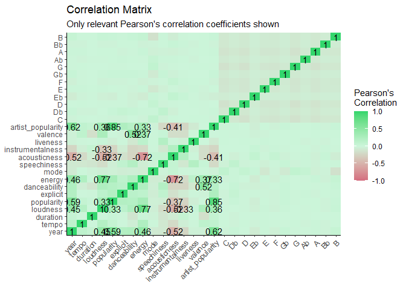

Predicting Popularity of Songs in Spotify
================
Daniel Redel
2022-10-14

## 1. Pre-Process Data

### 1.1. Normalization

We only need to normalize those variables that don’t take values between
0 and 1. We do that using the following function:

}{\max(x_i)-\min(x_i)}")

``` r
# Normalization Function
nor <- function(x) {
  (x-min(x))/(max(x)-min(x))
}
```

``` r
## We Normalize our variables
non_norm_var <- spotify_data[,c(3:5,9)]
data2 <- as.data.frame(lapply(non_norm_var, nor))

## Combine Data
normaldata <- cbind(spotify_data[,1], data2, spotify_data[,-c(1, 3:5,9)])

## Base final:
data <- normaldata
```

### 1.2. Data Partition

We split our data in a training sample and test sample. In this project,
we will work with only a subsample of songs, for computer size reasons.

``` r
## Sub-sample
set.seed(456789)
sample <- data %>% sample_frac(0.10)

## Train data and Test Data (70%-30%)
set.seed(123456)

r <- sample(nrow(sample))
shuffle_df <- sample[r,]

split <- round(nrow(shuffle_df)*.7)
train <- shuffle_df[1:split,]
test <-  shuffle_df[(split+1):nrow(shuffle_df),]
```

## 2. Descriptive Analysis

### 2.1. Popularity Distribution

<!-- -->

### 2.2. Heatmap Correlation

<!-- -->

## 3. Machine Learning Models for Prediction

### 3.1. Regression Model

``` r
# Regression Prediction #
model_reg <- lm(popularity ~ ., data = train[,c(2:28)])

##Saving our Predictions
pred_train0 <- predict(model_reg, train)
pred_test0 <- predict(model_reg , newdata = test)
```

We now report their accuracy:
<table>
<thead>
<tr>
<th style="text-align:left;">
Criteria
</th>
<th style="text-align:right;">
Linear Regression
</th>
</tr>
</thead>
<tbody>
<tr>
<td style="text-align:left;">
RMSE
</td>
<td style="text-align:right;">
9.4328283
</td>
</tr>
<tr>
<td style="text-align:left;">
RAE
</td>
<td style="text-align:right;">
0.4369623
</td>
</tr>
<tr>
<td style="text-align:left;">
R2_Score
</td>
<td style="text-align:right;">
0.7390723
</td>
</tr>
</tbody>
</table>

### 3.2. Decision Trees N°1:

``` r
# Regression Tree #
model_tree0 <- rpart(popularity ~ ., 
                    data = train[,c(2:28)], 
                    method = "anova")

##Saving our Predictions
pred_train0 <- predict(model_tree0, train)
pred_test0 <- predict(model_tree0, test)
```

<!-- -->

<table>
<thead>
<tr>
<th style="text-align:left;">
Criteria
</th>
<th style="text-align:right;">
Linear Regression
</th>
<th style="text-align:right;">
Decision Tree
</th>
</tr>
</thead>
<tbody>
<tr>
<td style="text-align:left;">
RMSE
</td>
<td style="text-align:right;">
9.4328283
</td>
<td style="text-align:right;">
9.5729511
</td>
</tr>
<tr>
<td style="text-align:left;">
RAE
</td>
<td style="text-align:right;">
0.4369623
</td>
<td style="text-align:right;">
0.4539796
</td>
</tr>
<tr>
<td style="text-align:left;">
R2_Score
</td>
<td style="text-align:right;">
0.7390723
</td>
<td style="text-align:right;">
0.7312627
</td>
</tr>
</tbody>
</table>

### 3.3. Decision Tree N°2: Prunning

We create a loop for different levels of depth an choose the one that
minimizes RMSE.

``` r
i=1                          
tree.optm=1                     
for (i in 1:12){ 
    tree.mod <-  rpart(popularity ~ ., 
                    data = train[,c(2:28)], 
                    method = "anova",
                    control = list(cp=0, maxdepth = i))
    pred <- predict(tree.mod, newdata = test)
    tree.optm[i] <- RMSE(pred, test$popularity)
    k=i  
    cat(k,'=', tree.optm[i],'\n')       
}
```

    ## 1 = 12.99008 
    ## 2 = 10.57482 
    ## 3 = 9.700356 
    ## 4 = 9.221258 
    ## 5 = 8.917877 
    ## 6 = 8.823415 
    ## 7 = 8.726332 
    ## 8 = 8.781815 
    ## 9 = 8.858789 
    ## 10 = 8.99117 
    ## 11 = 9.136423 
    ## 12 = 9.257005

We plot the resulting RMSE’s:

<!-- -->

As you can see, the optimal level is
.
We can now generate a pruned decision tree:

``` r
model_tree1 <- rpart(popularity ~ ., 
                    data = train[,c(2:28)], 
                    method = "anova",
                    control = list(cp=0, maxdepth = 7))

##Saving our Predictions
pred_train1 <- predict(model_tree1, train)
pred_test1 <- predict(model_tree1, newdata = test)
```

We can plot the resulting tree.

<!-- -->

Because the figure is difficult to interpret, we can report the relative
importance of each variable for the model:

<table>
<thead>
<tr>
<th style="text-align:left;">
</th>
<th style="text-align:right;">
Overall
</th>
</tr>
</thead>
<tbody>
<tr>
<td style="text-align:left;">
artist_popularity
</td>
<td style="text-align:right;">
7.1729406
</td>
</tr>
<tr>
<td style="text-align:left;">
year
</td>
<td style="text-align:right;">
5.1879612
</td>
</tr>
<tr>
<td style="text-align:left;">
duration
</td>
<td style="text-align:right;">
2.3667795
</td>
</tr>
<tr>
<td style="text-align:left;">
speechiness
</td>
<td style="text-align:right;">
1.9754333
</td>
</tr>
<tr>
<td style="text-align:left;">
energy
</td>
<td style="text-align:right;">
1.8498779
</td>
</tr>
<tr>
<td style="text-align:left;">
acousticness
</td>
<td style="text-align:right;">
1.7813330
</td>
</tr>
<tr>
<td style="text-align:left;">
loudness
</td>
<td style="text-align:right;">
1.6620124
</td>
</tr>
<tr>
<td style="text-align:left;">
danceability
</td>
<td style="text-align:right;">
1.6159093
</td>
</tr>
<tr>
<td style="text-align:left;">
valence
</td>
<td style="text-align:right;">
1.0398027
</td>
</tr>
<tr>
<td style="text-align:left;">
liveness
</td>
<td style="text-align:right;">
0.7596578
</td>
</tr>
<tr>
<td style="text-align:left;">
tempo
</td>
<td style="text-align:right;">
0.5390567
</td>
</tr>
<tr>
<td style="text-align:left;">
instrumentalness
</td>
<td style="text-align:right;">
0.4503693
</td>
</tr>
<tr>
<td style="text-align:left;">
explicit
</td>
<td style="text-align:right;">
0.3151802
</td>
</tr>
</tbody>
</table>

### 3.4. Model Assessment

<table>
<thead>
<tr>
<th style="text-align:left;">
Criteria
</th>
<th style="text-align:right;">
Linear Regression
</th>
<th style="text-align:right;">
Decision Tree
</th>
<th style="text-align:right;">
Decision Tree (Pruned)
</th>
</tr>
</thead>
<tbody>
<tr>
<td style="text-align:left;">
RMSE
</td>
<td style="text-align:right;">
9.4328283
</td>
<td style="text-align:right;">
9.5729511
</td>
<td style="text-align:right;">
8.7263324
</td>
</tr>
<tr>
<td style="text-align:left;">
RAE
</td>
<td style="text-align:right;">
0.4369623
</td>
<td style="text-align:right;">
0.4539796
</td>
<td style="text-align:right;">
0.3881096
</td>
</tr>
<tr>
<td style="text-align:left;">
R2_Score
</td>
<td style="text-align:right;">
0.7390723
</td>
<td style="text-align:right;">
0.7312627
</td>
<td style="text-align:right;">
0.7766943
</td>
</tr>
</tbody>
</table>

The Pruned Decision Tree is the best model.
